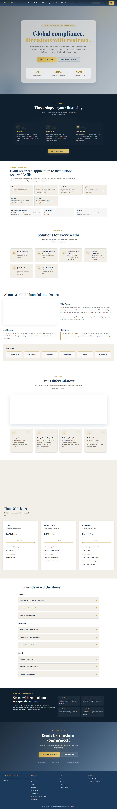
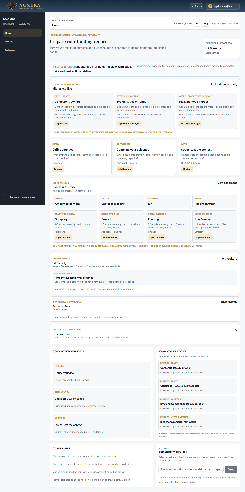
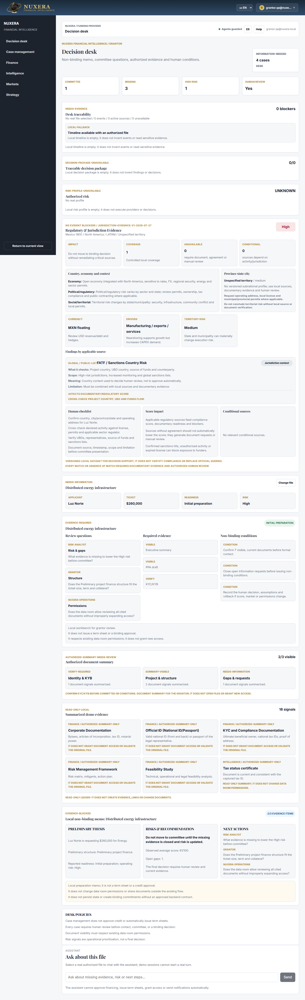
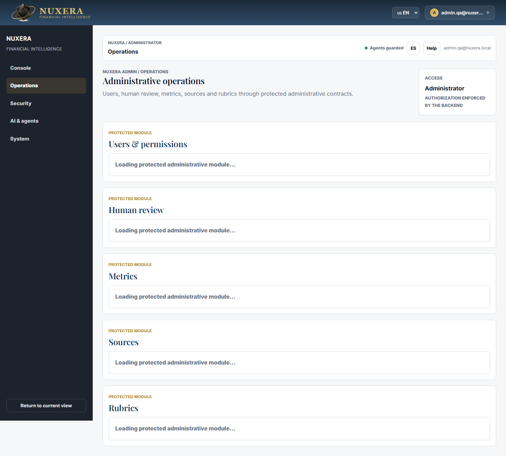

# NUXERA - Testing, Visual Evidence and Quality Status

Date: 2026-07-29  
Reviewed base: `https://nsd-pi.vercel.app`  
Purpose: provide evidence for internal review, partner review, investor presentation and the decision to replace Nexus with NUXERA.

## Executive Summary

This session confirms that the visible NUXERA experience is active on Vercel, the main English views load correctly, Nexus does not appear as a visible brand in the automated scenarios, and the critical local tests pass.

Main results:

- Automated English screenshots: 4 scenarios executed, 4 passed, 0 failed, 0 visible Nexus references.
- Focused backend tests: 4 test files passed, 86 tests passed.
- NUXERA frontend tests: 1 test file passed, 125 tests passed.
- Production frontend build: passed.
- Vercel smoke: main and production URLs return HTTP 200, show NUXERA and do not show visible Nexus.
- Render/backend smoke: in this run the backend timed out after 20 seconds on health and protected routes. This does not invalidate the frontend or local tests, but it remains an operational latency/availability item before a critical live presentation.

## Visual Scenarios Executed

### 1. Public Site

URL: `https://nsd-pi.vercel.app/`  
Expected: NUXERA Financial Intelligence identity visible.  
Result: passed.  
Visible Nexus: no.

### 2. Applicant

URL: `https://nsd-pi.vercel.app/dashboard`  
Simulated session: `applicant.qa@nuxera.local`  
Expected: NUXERA shell and Applicant role.  
Result: passed.  
Visible Nexus: no.

### 3. Funding Provider

URL: `https://nsd-pi.vercel.app/dashboard/nuxera/cases`  
Simulated session: `grantor.qa@nuxera.local`  
Expected: NUXERA shell and Funding provider role.  
Result: passed.  
Visible Nexus: no.

### 4. Administrator

URL: `https://nsd-pi.vercel.app/dashboard/nuxera/operations`  
Simulated session: `admin.qa@nuxera.local`  
Expected: NUXERA shell and Admin role.  
Result: passed.  
Visible Nexus: no.

## Technical Tests Executed

Focused backend:

- Scope: NUXERA jurisdiction intelligence, operational persistence, conversation agent readiness and NUXERA routes.
- Result: 4 files passed, 86 tests passed.

Frontend NUXERA:

- Scope: NUXERA experience tests.
- Result: 1 file passed, 125 tests passed.

Build:

- Scope: Vite production build.
- Result: passed in 4.58 seconds.

Remote smoke:

- Vercel main: HTTP 200, NUXERA visible, Nexus not visible.
- Vercel production/alias: HTTP 200, NUXERA visible, Nexus not visible.
- Render health and backend routes: 20-second timeout in this execution.

## Interpretation

NUXERA is in good condition for a controlled visual and functional demonstration. The live backend on Render should be warmed, monitored or moved to a more predictable runtime before a high-stakes presentation that depends on API responses.

Presentation recommendation:

1. Use Vercel as the primary live demo surface.
2. Keep screenshots available as a fallback.
3. Avoid depending on Anthropic/Render/NVIDIA live calls unless the service is warmed beforehand.
4. Present agents, notifications and persistence as gated operating capabilities, not unsupervised automation.
